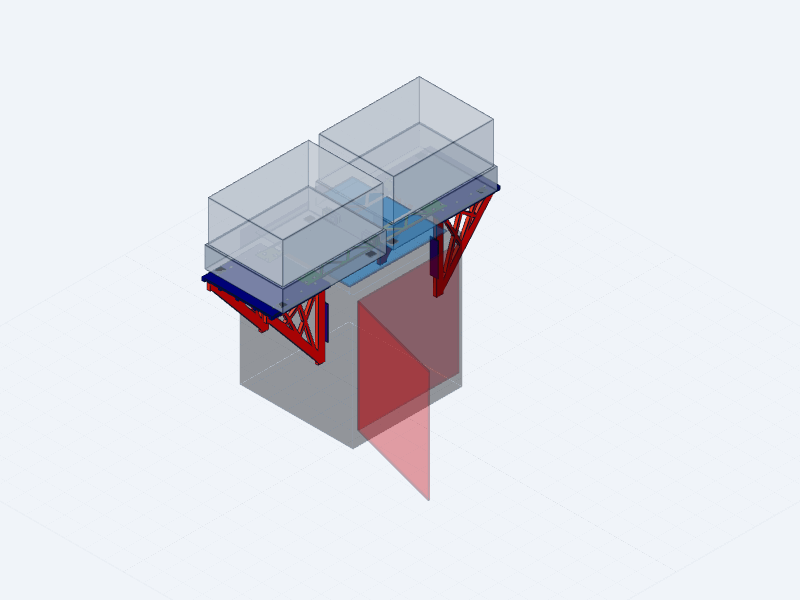

# Bambu X2D Dual AMS 2 Pro Mount

STEP-first project for a no-drill mount carrying two AMS 2 Pro units centered
side-by-side across the top of a Bambu Lab X2D. A provisional parametric assembly has been
generated. It is a fit-review prototype, not a production-ready mount: the X2D
rim, glass, door, and AMS feet still use explicitly labeled assumed geometry
until measurements are taken from the actual hardware.

  

<em>35° elevated view · 3 rpm Z-axis orbit · 20-second loop</em>

## Current CAD deliverables

- `x2d_dual_ams_mount_assembly.step`: labeled assembled STEP with the X2D,
  closed/open door, and two AMS units included as simplified references.
- `x2d_dual_ams_mount_geometry.py`: shared parametric geometry and dimensions.
- `x2d_dual_ams_mount_assembly.py`: assembly entry point with `gen_step()`.
- `validate_mount.py`: deterministic print-envelope, support, M4, collision,
  bridge-joint, glass, and door-clearance checks.
- `printable_parts/*.step`: 14 separate, manufacturing-oriented STEP files—one
  for each printed shelf, bracket, tie half, and side pad occurrence.
- `validate_printable_parts.py`: single-solid, saved-orientation, print-envelope,
  and source-volume checks for all individual exports.
- `docs/Bambu_X2D_Dual_AMS2_Pro_Mount_Assembly_Guide.pdf`: illustrated
  18-page assembly and fit-check guide with one numbered step for each of the
  14 printed objects. The editable source is `docs/assembly_guide.html`.
- `snapshots/`: four-view visual review packet generated from the STEP.
- `assets/x2d_dual_ams_mount_turntable.gif`: README turntable rendered at a
  35° elevation and 3 rpm. Its reproducible CAD render settings are stored in
  `assets/turntable_render_job.json`.

The current assembly contains 14 individually printable structural parts. M4
screws and standard hex nuts are modeled as purchased hardware; every
load-bearing member is printed ASA.

The individual files under `printable_parts/` are centered on XY and rest on
Z=0. Brackets are laid on their broad truss face and side pads on their largest
face so the files open in the intended manufacturing orientation. See
`printable_parts/README.md` for the complete file and size index.

## Verified product envelopes

Dimensions use the manufacturers' conventional width × depth × height order.

- Bambu Lab X2D: 392 × 406 × 478 mm; 16.25 kg empty.
- X2D main-nozzle print area: 256 × 256 × 260 mm.
- AMS 2 Pro: 372 × 280 × 226 mm; 2.5 kg empty.
- AMS 2 Pro spool envelope: 50–68 mm wide and 197–202 mm diameter.
- AMS 2 Pro maximum drying temperature: 65 °C.

The two 372 mm AMS bodies are separated by 25.4 mm and centered as a pair.
Their combined width is 769.4 mm, so each body extends 188.7 mm beyond its
corresponding X2D side. The modeled inner feet remain on the X2D top while the
outer feet land on the two printed side shelves. Each shelf ends 25.4 mm beyond
its AMS outer face, at X=±410.1 mm.

## Confirmed architecture

- Two fully outboard support shelves: one extending from each X2D side and
  carrying the outer foot row of its adjacent AMS.
- Both AMS units face forward in the same direction as the X2D. Their 372 mm
  width runs global left-to-right and their 280 mm depth runs front-to-back.
- AMS centers are X=±198.7 mm, giving an exact 25.4 mm center gap and a pair
  centered on X=0.
- One front and one rear triangular bracket below each shelf.
- 25.4 mm outer chords on each right-triangle bracket, matching the requested
  one-inch outer members.
- Smaller internal triangular webs with broad, radiused intersections. Initial
  candidate: 10–12 mm web width and 10–12 mm bracket thickness, subject to the
  final span and material.
- Flat upper shelf surface with an underside rib grid and uninterrupted front
  and rear mounting lands. Initial candidate: 5–6 mm skin plus 4–6 mm ribs.
- M4 button-head screws through plain 4.5 mm shelf clearance holes into
  replaceable captive nuts in the bracket top chords. The bracket screw heads
  remain proud of the shelf top; the nut pockets are 7.4 mm across flats.
- Replaceable printed ASA contact pads at the provisional printer interfaces.

The provisional 320 × 220 mm foot pattern places the outer foot rows at
X=±358.7 mm, fully on the shelves, and the inner foot rows at X=±38.7 mm,
fully on the modeled X2D top. All foot bottoms remain at Z=0. The 280 mm AMS
depth overhangs the centered 252 mm shelf depth by 14 mm front and rear.

## Recommended printer interface

The centered bodies leave no room for the previous tall cross-printer beams.
The current STEP therefore uses two removable 50 mm-deep planar ASA truss ties
at Y=±70 mm, between the provisional foot rows. Their spans occupy Z=0–3 mm,
leaving 1 mm below the assumed AMS body underside. Each 249 mm half overlaps a
shelf by 50 mm and uses three flush M4 bolts. Three transverse M4 bolts join
narrow 25.4 mm-high center bosses that stay inside the AMS center gap.

The ties currently bear on the modeled X2D top/glass datum. That interface is
not defined by published dimensions and must be physically verified. If direct
glass contact is unsuitable, a measured rim or structural insert interface is
required before production printing.

## Decisions embodied in the first STEP

Confirmed:

- Two fully outboard shelves, one per side.
- Both AMS units face forward; the 372 mm AMS width runs side-to-side.
- The two AMS units are centered as a pair with a 25.4 mm gap.
- ASA is the production material.
- Every print part is limited to 252 mm in X, Y, and Z.
- Each shelf is 211.1 × 252 mm with a 6 mm top skin and 6 mm-deep underside
  ribs. Its 211.1 mm outboard span runs from the printer-side root at
  X=±199.0 mm to X=±410.1 mm, exactly 25.4 mm beyond the AMS body.
- Outer feet use the side shelves; inner feet use the X2D top at the same Z=0.
- Two 3 mm low-profile printed tie trusses connect the shelves without lifting
  any foot or crossing either provisional foot row.
- Standard M4 hex nuts are used in 7.4 mm-across-flats captive pockets.
- The bridge is service-removable for top-glass access; the glass is not
  expected to lift through the installed front/rear bridge pair.

Still required before production printing:

1. Confirm the X2D is the printer used to make the parts and that a 252 mm part
   plus ASA brim/adhesion strategy is practical on its 256 mm plate.
2. Measure the physical interfaces listed below and replace every provisional
   reference value in the parametric source.
3. Verify that the Y=±70 mm tie zones clear the real AMS underside and decide
   whether direct contact with the top glass is acceptable. The ties are
   removable with M4 hardware for glass service.

## Measurements required

Use calipers where practical and photograph each measurement:

- X2D top-rim width at the front, rear, left, and right.
- Glass size, thickness, edge gap, corner radius, and removal direction.
- Cross-section of the top edge: top bearing surface, lip height/thickness,
  side-panel setback, and any undercut that a saddle can capture.
- Safe vertical contact height on both side panels and locations of seams,
  doors, vents, screws, and removable panels.
- Front and rear bracket locations that do not obstruct the screen, door,
  rear fan/extruder, purge chute, spool hardware, or service access.
- Front-door top edge, hinge positions, and full opening sweep near both upper
  corners so the front bridge can be checked against a door keep-out volume.
- AMS bottom-foot center spacing in both axes, foot dimensions, and foot height.
- AMS underside vent/opening locations that the shelf must not block.
- Desired PTFE and cable exit directions, plus an overhead-clearance check with
  both AMS lids fully open.

## Structural targets for the first design

- Treat each shelf as a 10 kg working-load prototype even though an empty AMS
  is much lighter; this leaves room for four loaded spools and handling loads.
- Size the geometry against a 2.5× internal load case, then physically test the
  completed shelf away from the printer before installation. This is a design
  target, not a certified load rating.
- Use at least three M4 fasteners per bracket-to-shelf joint; four are preferred
  if the measured bracket length permits adequate edge spacing.
- Print each bracket flat on its broad face so its primary tension and
  compression paths lie in the layer plane.
- Add large fillets at chord/web intersections and avoid sharp-ended ribs or
  nut pockets near highly loaded roots.
- Add a secondary retention strap or tether for each AMS.
- Keep the shelf support Z unchanged by the bridge connection; no bridge or
  receiver is permitted beneath an AMS support pad.
- Require positive clearance between every front-beam component and the full
  front-door opening envelope.

## First-assembly validation results

- All 14 printed parts are valid, connected single solids and fit within a
  252 mm single-part envelope.
- Exact STEP measurements: AMS gap 25.4 mm; centered pair width 769.4 mm;
  centers X=±198.7 mm; shelf outboard span 211.1 mm; shelf extension beyond
  each AMS 25.4 mm; outer-foot lift 0 mm; inner-foot lift 0 mm; planar
  tie-to-body clearance 1 mm; center-boss-to-AMS clearance 3.7 mm per side.
- Each tie half is 249 × 50 × 25.4 mm and the center bosses have zero modeled
  interference.
- All modeled structural members clear both the closed-door volume and the
  open-door keep-out volume.
- The complete reference assembly bounds are 820.2 × 756.88 × 704 mm; depth
  includes the intentionally displayed open-door keep-out and height includes
  the printer below and AMS envelopes above the common top datum.

## Service and reliability notes

- Preserve airflow below the AMS 2 Pro; its active drying system should not sit
  on an unvented full-contact slab.
- Keep PTFE paths broad and supported. The X2D community has reported feed
  sensitivity when tubes rub the top glass or are forced through tight bends.
- A flat top surface can be retained while vent windows, foot pads, and stiff
  ribs are placed underneath.
- Print small coupons for the center-boss joint, tie/shelf overlap, M4 nut trap,
  tie button-head recess, and ASA side-pad fit before committing to full-size
  parts.

See `cad_brief.md` for the modeling contract and `reference/SOURCES.md` for
dimension provenance. See `connection_concept.md` for the centered AMS support
and all-printed low-profile shelf-tie design.
