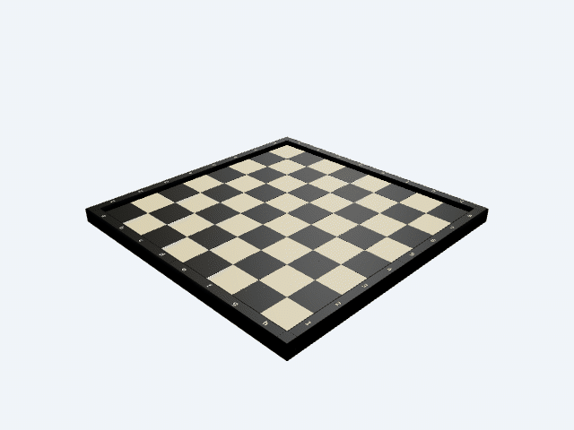

# 60 mm Modular Chessboard for Bambu Lab X2D

STEP-first, eight-panel chessboard with a raised contrasting perimeter,
algebraic notation, captured-nut assembly hardware, and print-ready STEP/STL
files sized for the Bambu Lab X2D. A legacy four-quarter layout remains in the
project as an alternate build path.



The animation shows the assembled eight-panel configuration, including the
playing face, raised perimeter, and underside seam bridges.

## Design summary

- Square size: 60 mm, the largest size in the current FIDE 50-60 mm range.
- Playing area: 480 x 480 mm.
- Perimeter: 20 mm wide and 10 mm above the 9.6 mm playing surface.
- Perimeter edge treatment: 2 mm comfort fillets on all exposed top edges;
  mating seams remain square for a continuous assembled surface.
- Assembled footprint: 520 x 520 mm.
- Playing sections: eight named two-file-by-four-rank panels, nominally
  120 x 240 mm before joinery.
- Concealed upper registration keys at every internal panel edge keep the
  playing surfaces flush.
- Fit-critical interfaces use 0.5 mm lead-ins and 0.4 mm first-layer relief.
- Each corner cap has a hidden M2 x 12 positive-retention cross-screw.
- Largest playing-panel envelope: 124 x 244 mm. The longest perimeter rail is
  247.05 x 35 mm. Both fit the X2D's 256 x 256 mm main-nozzle area, while the
  narrower panels reserve room for supports and a prime tower.
- Material: PLA Matte.
- Recommended color intent: ivory/light, dark brown, black perimeter, ivory
  notation.
- `a1` is dark. White sits at the `a-h` side whose letters read upright.

The user's 33 mm pawn bases require at least 66 mm for a two-by-two group, so
the same piece set cannot satisfy FIDE's separate four-pawns-on-one-square
suitability statement inside the permitted 60 mm maximum. This board therefore
uses the largest permitted square and gives the supplied pieces as much room as
possible without exceeding that dimensional guideline. It is a geometric
design, not FIDE endorsement or tournament certification.

## Primary files

- `chessboard_geometry.py` - shared parametric build123d geometry.
- `eight_panel_chessboard_assembly.py` /
  `eight_panel_chessboard_assembly.step` - complete assembled review model
  using eight 120 x 240 mm playing panels and sixteen underside bridges.
- `eight_panel_print_kit.step` - recommended support/prime-tower layout: 68
  printable objects containing 100 colored leaf solids in thirteen labeled
  virtual-plate modules.
- `panel_{south,north}_{ab,cd,ef,gh}_light_body.step` - eight individual,
  single-solid playing-panel STEP files for direct Bambu Studio import. Their
  maximum envelope is 124 x 244 mm. Each STEP's top-level product label
  matches its filename stem so Bambu Studio retains the panel identity.
- `eight_panel_geometry.py`, `eight_panel_print_kit.py`, and
  `validate_eight_panel.py` - parametric source, plate layout, fit, mesh, and
  exported-name checks for the eight-panel design.
- `rail_*.step` - two-color perimeter rail assemblies containing the black
  rail and ivory notation bodies.
- `meshes/` - individual structural and loose-inlay STL files.
- `validate_eight_panel_export.py` - re-imports the eight-panel STEP and checks
  the separated playing panels and other print objects.
- `validate_stl_watertightness.py` - verifies two-triangle manifold edges on
  every perimeter-rail STL mesh.
- `cad_brief.md` - design assumptions and validation intent.
- `snapshots/` - rendered inspection packet.
- `docs/chessboard_rotation.gif` - looping assembled-board animation used at
  the top of this README; regenerate it with `generate_readme_animation.py`.
- `docs/FIDE_60mm_Modular_Chessboard_Assembly_Instructions.pdf` - printable
  seven-page installation and assembly manual for the eight named panels,
  sixteen underside bridges, perimeter rails, and positive-retention corners.
- `chessboard_assembly.step`, `separated_print_kit.step`, and `quarter_*.step`
  - legacy four-quarter review and print files.

## Printed parts and quantities

| Part | File | Quantity |
| --- | --- | ---: |
| Named 1/8 playing panels | `meshes/panel_*_light_body.stl` | 1 each / 8 total |
| Named perimeter rail bodies | `meshes/rail_*_body.stl` | 1 each / 8 total |
| Seam bridge | `meshes/seam_bridge.stl` | 16 |
| Corner cap | `meshes/corner_cap.stl` | 4 |
| Loose dark-square inlay | `meshes/loose_dark_square_inlay.stl` | 32 |
| Complete notation inlay set | `meshes/notation_insert_set.stl` | 1 set |

The notation set contains two copies of `a-h` and two copies of `1-8`.

Each playing panel contains two files by four ranks and six M3 nut traps: two
on each long edge and one on each short edge. Across all eight panels, those
48 captured nuts receive 32 bridge screws and 16 rail screws.

## Hardware

- 48 x M3 x 12 mm screws.
- 48 x standard M3 hex nuts, nominally 5.5 mm across flats and 2.4 mm thick.
- 4 x M2 x 12 mm screws.
- 4 x standard M2 hex nuts, nominally 4.0 mm across flats and 1.6 mm thick.
- 12 adhesive felt or rubber pads sized to fit the rail/corner recesses.
- PLA-compatible adhesive for the 32 dark-square inlays.

The recessed M3 screw-head envelope is 6.8 mm diameter x 3.2 mm deep. The M2
corner-lock head envelope is 4.5 mm diameter x 2.2 mm deep. Check the actual
heads and nuts before committing to the long prints.
The legacy four-quarter M3 pockets provide about 0.22 mm across-flats
clearance and 0.40 mm thickness clearance. The M2 corner-lock pockets provide
0.25 mm across-flats clearance and 0.30 mm thickness clearance.

After the PLA Matte fit test, the eight-panel playing bodies use a slightly
more forgiving panel-only M3 interface: a 6.1 mm side-entry channel, a 5.8 mm
hex pocket across flats, and a 3.6 mm vertical screw passage. The 0.5 mm
opening lead-in and 2.8 mm pocket/channel height are unchanged. This provides
0.30 mm total across-flats clearance around a nominal 5.5 mm M3 nut. Rails,
seam bridges, corner caps, and the legacy four-quarter bodies retain their
existing dimensions.

Each eight-panel playing body also includes a 0.2 x 0.2 mm relief at its three
internal checker vertices. The sub-nozzle feature prevents diagonal raised
light regions from producing a non-manifold mesh edge in slicers while keeping
the 60 mm square pitch and dark-inlay seats unchanged.

## Color workflows

### Eight-panel support/prime-tower workflow (recommended)

Use `eight_panel_print_kit.step` as the replacement master when the 244 x
244 mm legacy quarter panels leave no room for a support prime tower. Its first eight
modules are the panels `south_ab`, `south_cd`, `south_ef`, `south_gh`, then
`north_ab`, `north_cd`, `north_ef`, and `north_gh`. Each contains two
chessboard files by four ranks, so every added seam follows a square boundary.

After moving a panel to a new 256 x 256 mm Bambu Studio plate, position its
center about 60 mm left of plate center. A 124 mm-wide panel then leaves 126 mm
of clear width on the right; the two 120 mm-wide `gh` panels leave 128 mm.
Use that area for normal/snug supports and the prime tower. Keep the long panel
axis centered in Y; the 244 mm maximum length leaves 6 mm total plate margin
before any brim.

The master also contains the eight rail objects, two dark-inlay plates,
sixteen seam bridges, and four caps. Individual
`panel_*_light_body.step` files are available when importing one panel at a
time is simpler than splitting the master assembly. Because every panel STEP
has a filename-matched product label, Bambu Studio should show distinct panel
names instead of an OpenCascade occurrence identifier.

Keep every `multicolor_rail:*` entry as one multi-part object; do not split its
four notation glyphs into separate objects. Within each rail object, assign
the rail body to black and its inset notation to ivory. Print all eight panel
bodies in the chosen light color. Print the 32 loose dark-square inlays in the
dark color, dry-fit them, and glue them flush into the panel recesses.

### Legacy four-quarter workflows

Import one `quarter_*.step` at a time into Bambu Studio as a single object with
multiple parts. Assign the light body to ivory and the eight exact square
bodies to dark brown. Import each `rail_*.step` the same way and assign the
body to black and notation to ivory.

The 244-247.05 mm parts fit the X2D main-nozzle area but exceed its 235.5 mm
dual-nozzle intersection. Use a multi-material path that keeps all geometry
inside the selected nozzle's reachable area. If Bambu Studio reports an
auxiliary-nozzle reach or prime-tower conflict, use the loose-inlay workflow.

The older `separated_print_kit.step` and `quarter_*.step` files remain usable,
but their 244 x 244 mm playing bodies leave very little room for supports,
brims, or a prime tower. The assembly manual and quantities below apply to the
recommended eight-panel design.

### Glue-inlay STL workflow

1. Print the eight `panel_*_light_body.stl` bodies in ivory.
2. Print 32 copies of `loose_dark_square_inlay.stl` in dark brown. Each is
   59.6 x 59.6 x 1.6 mm, providing 0.2 mm nominal clearance per edge inside a
   60 mm square well.
3. Print the eight rail bodies in black.
4. Print `notation_insert_set.stl` once in ivory.
5. Dry-fit, then glue the dark squares and flush notation glyphs into their
   pockets.

The legacy quarter-panel route nearly fills the plate and cannot reserve the
same support/prime-tower space.

## Suggested PLA Matte settings

- 0.4 mm nozzle and 0.20 mm layers.
- Four or five walls.
- Six top and bottom layers on the playing panels.
- 15-20% gyroid or cubic infill; the exported bodies are solid CAD volumes, so
  the slicer controls internal material use.
- A 3-4 mm brim on the playing panels and rails, with placement checked against
  the 256 mm plate boundary and prime tower.
- Print playing panels with the broad underside on the build plate.
- Print rails and seam bridges with their recessed screw-head faces on the
  build plate.
- The lower locating tongues and corner ribs begin on the build plane. The
  open-sided panel grooves have flat ceilings around Z = 2.9 mm and may need
  painted normal/snug support depending on the selected PLA and support
  material. The eight-panel layout reserves prime-tower space for this case.
- Use slower first layers and allow the plate to cool before removing the
  large panels.

## Assembly

Each 1/8 panel contains six side-loading M3 nut pockets: two per long edge and
one per short edge. Load all six nuts before closing a matching seam or
installing its perimeter rail.

1. Place the eight panels face-down on a protected, flat surface. From White's
   side, the south row is `south_ab`, `south_cd`, `south_ef`, `south_gh`; the
   north row is `north_ab`, `north_cd`, `north_ef`, `north_gh`.
2. Slide a standard M3 nut through every 6.1 mm entry channel until it seats in
   the 5.8 mm hex pocket over the 3.6 mm screw passage. Confirm each nut can
   receive a screw before joining panels.
3. Join each row from left to right: `ab` to `cd`, then `ef`, then `gh`.
4. Slide the complete north row southward onto the north-facing tongues of the
   south row. The lower tongues carry shear and the concealed upper keys keep
   the playing faces flush.
5. Install twelve `seam_bridge` parts across the three vertical seams at
   X = -120, 0, and 120 mm. Each seam receives bridges at Y = -180, -60, 60,
   and 180 mm.
6. Install four rotated bridges across the horizontal center seam at Y = 0,
   using X = -180, -60, 60, and 180 mm. Use two M3 x 12 screws per bridge.
7. Slide each named rail tongue into the corresponding outer panel groove and
   fasten it from below with two M3 x 12 screws.
8. Drop one M2 nut into the open-top lock channel on each of these rail ribs:
   `bottom_ad`, `right_14`, `top_eh`, and `left_58`. The nut settles into its
   horizontal hex pocket.
9. Slide four corner caps downward over the vertical ribs where adjacent rails
   meet. Rotate each identical cap so its recessed cross-hole faces the nearby
   outside edge, then install one M2 x 12 screw through the cap and selected
   rib into the captured nut.
10. Apply felt/rubber pads to the eight rail and four corner recesses, then turn
   the board over.

Do not overtighten the screws. Tighten only until the seams close and the board
is flat; PLA can creep or crack under excessive fastener preload.

Each 240 mm horizontal rail spans two 120 mm panels and helps reinforce the
added vertical seam.

## Rail placement

- White side: `rail_bottom_ad`, then `rail_bottom_eh`.
- Opposite side: `rail_top_ad`, then `rail_top_eh`.
- Left side from White's perspective: `rail_left_14`, then `rail_left_58`.
- Right side: `rail_right_14`, then `rail_right_58`.

## Regeneration and validation

Run from this directory with the CAD skill Python environment available:

```bash
python /path/to/cad/scripts/step eight_panel_chessboard_assembly.py
python validate_eight_panel.py
python validate_eight_panel_export.py eight_panel_print_kit.step
python validate_stl_watertightness.py
python /path/to/cad/scripts/inspect refs eight_panel_chessboard_assembly.step \
  --facts --planes --positioning
python /path/to/cad/scripts/snapshot --job eight_panel_snapshot_job.json
```

The current generated assembly was checked at 520 x 520 x 27.6 mm, with a
480 x 480 mm playing area, 60 mm square measurements in X and Y, a 10 mm
perimeter rise, zero reported flush-alignment deltas at representative panel,
rail, and bridge interfaces, sixteen correctly positioned seam bridges, eight
closed playing-panel solids, no non-manifold playing-panel mesh edges, a clear
M2 corner-lock screw path, and filename-matched panel STEP product labels.

References:

- [Current FIDE chess-equipment specification](https://handbook.fide.com/chapter/ChessEquipmentWithoutElectronicComponenets032026)
- [Bambu Lab X2D specifications](https://blog.bambulab.com/xcellence-made-simple-bambu-lab-presents-the-x2d/)
